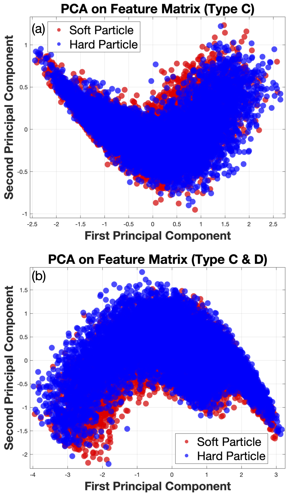

The code and data related to my PhD thesis
==============

Figures
-----------------
The each figure in the thesis can be found in the "Figures" directory. The majority of the figures were drawn in Keynote and converted to PDF format, while some were generated using Python code.

Published Works in my Thesis
-----------------
Chapter 4: https://github.com/anwanguow/graph_phase_transition;

Chapter 5: https://github.com/anwanguow/GP_structural;

Chapter 6: https://github.com/anwanguow/PH_structural.

Examples 
-----------------
In Section 5.2.5.3 of my PhD thesis, I calculated the Type C/D descriptors for each particle sample and constructed a feature matrix by concatenation, followed by PCA analysis, with the results shown in the following figure.

Referring to the method used by Lei Wang in [Phys. Rev. B 94, 195105](https://journals.aps.org/prb/abstract/10.1103/PhysRevB.94.195105), where the matrix of configurations of the Ising model at different temperatures were concatenated and analyzed by PCA, it was found that this approach is highly effective for phase classification and detecting the critical point of the second-order phase transition in the Ising model. However, when I applied the same method to predict the mobility trend in a multi-particle system in my thesis, the method outputs nothing meaningful.

The code for this example is in "Examples" directory of this repo and detailed in repo: https://github.com/anwanguow/pca_ising.

Contact
-----------------
An Wang: amturing@outlook.com 
